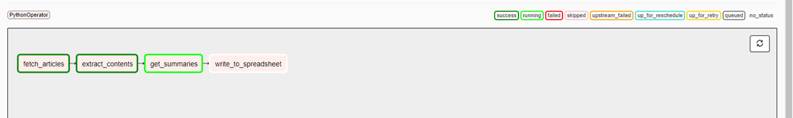

# Readings Archiver Tool

For this project, I built an Airflow-orchestrated pipeline to help keep track of all the articles I read. It (i) retrieves articles I saved to the [Pocket app](https://getpocket.com/), (ii) scrapes article text, (iii) generates summaries and (iv) writes the results to a Google Sheet, so I have all the articles I found useful in one convenient place. This project was motivated by my interest in working with cloud and workflow orchestration tools, as well as a need to better remember all the readings I do on a daily basis.

I chose to use Airflow as I needed a way to programmatically schedule a series of tasks that depend on the results of previous ones (i.e. retrieve list of articles --> scrape full text --> generate article summaries --> save everything to a spreadsheet). I chose MongoDB to store data from intermediate steps due to its flexible schema-less nature and ease of setup.

The project runs on AWS, with the setup outlined below:

The job is scheduled to run daily at a specified time, pulling in new articles saved since the day before. The DAG looks as follows:

The end result is a spreadsheet that lists all the articles I have saved, as well as their full text (in case the links become broken later on) and summary.

## AWS Setup Details

To set up Airflow, I followed this [tutorial](https://medium.com/@taufiq_ibrahim/apache-airflow-installation-on-ubuntu-ddc087482c14) using Postgres (instead of the default sqlite) as the database backend and LocalExecutor (instead of SequentialExecutor) as the executor, so Airflow can run more than one task at a time. I was also able to set up Slack alerts thanks to this [handy guide](https://medium.com/datareply/integrating-slack-alerts-in-airflow-c9dcd155105). 

To set up MongoDB, I followed instructions from the [official site](https://docs.mongodb.com/manual/tutorial/install-mongodb-on-amazon/). To manage backups, I used `mongodump` to create a binary export of the database, which is then uploaded onto the S3 bucket for storage. Note that Amazon has a managed NoSQL database offering ([`DocumentDB`](https://aws.amazon.com/documentdb/)) but it is costly to use. MongoDB also has its own managed database services, [`MongoDB Atlas`](https://www.mongodb.com/cloud/atlas), which can be accessed in a secure manner via AWS PrivateLink. I decided to set up my own MongoDB server instead of using Atlas because I wanted to learn more about networking on AWS.

To organize project resources, I created a Virtual Private Cloud (VPC) with private and public subnets. Under this setup, I limited access to only when strictly necessary following security best practices.

The instance with Airflow sits in the public subnet and has an [Elastic IP address](https://docs.aws.amazon.com/AWSEC2/latest/UserGuide/elastic-ip-addresses-eip.html) so it is reachable from the Internet. This instance has unlimited outbound access so it can make API calls to retrieve my saved articles and update the tracking spreadsheet. I limited inbound access to only SSH connections (on port 22) and TCP connections on port 8080 (Airflow webserver) from my laptop. The instance with the database sits in the private subnet and has only a private IP. It can only be accessed from the first instance via SSH (port 22), and port 27017 is exposed to the instance (MongoDB server). All inbound and outbound rules are managed with [security groups](https://docs.aws.amazon.com/vpc/latest/userguide/VPC_SecurityGroups.html).

To limit access to the S3 bucket, I set a [bucket-wide policy](https://docs.aws.amazon.com/AmazonS3/latest/dev/example-bucket-policies-vpc-endpoint.html) to allow access only from the specific VPC while blocking public access.

To store credentials information for Pocket and GSheet, I used [AWS Secrets Manager](https://aws.amazon.com/secrets-manager/). Secrets under Secrets Manager can be conveniently [accessed using the `boto3` package](https://aws.amazon.com/blogs/security/improve-availability-and-latency-of-applications-by-using-aws-secret-managers-python-client-side-caching-library/) in Python. This keeps my credentials secure and in one central place. The EC2 instance running Airflow was [granted an IAM role](https://aws.amazon.com/premiumsupport/knowledge-center/assign-iam-role-ec2-instance/) with SecretsManagerReadWrite policy so it can access the secrets.

## Scripts

All package dependencies are listed in `requirements.py`. 

`dag_archiver.py` specifies the DAG and imports from the `scripts` folder. Both `dag_archiver.py` and `scripts` should be placed within the `dags` folder of Airflow's home directory.

- `dag_archiver.py`: defines the DAG and task success/fail alerts
- `scripts/fetch_articles.py`: fetches saved articles with a call to the Pocket API, and writes the article metadata (e.g. title, url) to the database
- `scripts/extract_contents.py`: performs full text extraction from article HTML pages, and writes the results to the database
- `scripts/get_summaries.py`: generates article summaries using the [`transformers`](https://huggingface.co/transformers/) package's implementation of the [`BART` model](https://sshleifer.github.io/blog_v2/jupyter/2020/03/12/bart.html), which is a transformer-based seq2seq model that improves on BERT and GPT through a different pre-training scheme
- `scripts/write_to_spreadsheet.py`: writes saved articles, along with their text and summaries, to the tracking spreadsheet with a call to the Google Sheets API

Logs are added at each step of the process and written to Airflow logs, which can be inspected through the web interface.

## Next Steps

- Keep experimenting with the text summarization model, since the results are not great so far
- Introduce automatic tagging/keyword generation on articles, which is currently a manual process (I've played around with RAKE, tf-idf and TextRank, but the results all required significant cleanup). If a completely unsupervised topic detection method is not feasible, another possibility is to start with a predefined list of topics, and train a text embeddings-based classifier to assign the best labels on future articles
- Try using a more efficient setup - since the `BART` model is quite large, I had to opt for an EC2 instance with more CPU and RAM (t3a.2xlarge). The cost of keeping the instance running is quite high, even though the DAG job only runs for a few minutes a day. Ideally this should be a containerized solution that only takes up resources as needed to execute the tasks
